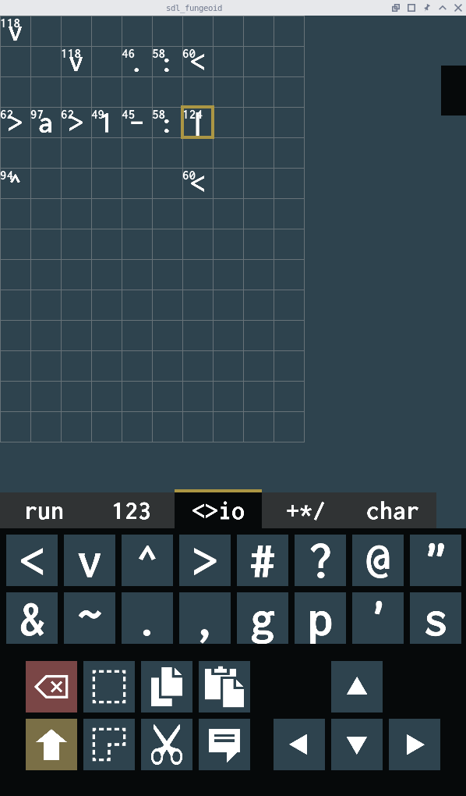

# sdl_fungeoid

Fungeoid (Befunge-like) game for GNU/Linux and Android

Made it because I wanted to learn C and SDL. I also had to write a bit of
platform-dependent code to create the file chooser dialogs: for Android I made
a simple Activity using Java and for GNU/Linux I'm using a GTK3 file chooser
dialog.



[Fungeoids](https://esolangs.org/wiki/Fungeoid) are a family of similar
programming languages, the most popular is
[Befunge93](https://esolangs.org/wiki/Befunge). These languages are not useful,
instead they are slightly fun.

The interesting thing is that the language is:

- Two dimensional, there is a grid of instructions, each one represented by a
    letter.

- The _Program Counter (PC)_ is a pointer to the current instruction that
    moves up, down, left or right.

- The memory is the grid itself because you can read and write to it,
    self-modifying code is possible.

- The language is really difficult to compile.

- See the [Befunge93](https://github.com/catseye/Befunge-93/blob/master/doc/Befunge-93.markdown)
    documentation.

There are a lot of Befunge93 interpreters around but writing Befunge93 on a text
editor is very cumbersome, *sdl_fungeoid* tries to be easy to use especially on
Android.

I added some instructions to Befunge93 to make the language more fun, so you can
choose between two languages:

- Befunge93: The most popular one.
- VeryFunge93: Befunge93 plus some instructions.

## Development

### Code overview

Check the first comment on every header file.

- Input handling:

    - `screens.c` handles window and quit events, then, calls
        `input_handle_event()` so the input handles the touch/mouse/keyboard
        events.

    - `input_handle_event()` returns an `Input` struct, `screens.c` passes the
        struct to the keyboard

    - If the keyboard returns `KEYB_EVENT_NOT_HANDLED` then `main.c` should pass
        the input to the element below, e.g. the HUD.

    - If the HUD does not handle the input then the input is passed to the
        keyboard, field, etc.

### Code style

I'm learning C, I have to remember to:

- Return zero on success and one on error.

- Set variables to some value on declaration, pointers to NULL.

- Set pointers to NULL when freeing memory.

- Use `static` for global variables and private functions.

- Can't define global variables on header files, see `COLOR_XX` for example.

- For every struct with a constructor:

    - Create a constructor `structname_create()` function that returns NULL on
        error. Remember to free the memory allocated inside the constructor on
        error.

    - Create a destructor function `structname_free()` that returns void, do not
        check for NULL pointer because `free()` can handle NULL pointers, but if
        the struct has pointers inside I have to free them after checking
        for a NULL pointer.

### Things to do

- Fix that the game looks fullscreen on Android and is drawn below the
    notification bar.

- Fix that while the load file GTK dialog is open, the game is frozen and inputs
    are buffered until the dialog is closed, where they are received together at
    the same time.

### SDL Notes

I'm just copying and pasting the SDL sources into this repo so the Android build
works. I should update them manually.

Also I had to do modifications to `Android.mk` on `SDL_image`:

- Change to `SUPPORT_WEBP ?= false`.

- Delete `IMG_WIC.c       \`

### SDL and Android notes

The Android part of this game is quite hacky and horrible. I'm not even sure
what I'm doing as I have no experience on Android, JNI and Java in general.

I wanted a file chooser so you can open and save files, looks like SDL is not
designed for my use case.

How I'm doing it:

- When the open button is pressed, my code on C calls some function on `os.h`.

- The functions I've written on `os.c` are based on source code from SDL, I
     think I got it from `Android_JNI_GetClipboardText()` located on
    `SDL_android.h`.

- On the Java side I did extend `SDLActivity` as explained on SDL's
    `README-android.md`. So my main Activity is on `SDLFungeoid.java`.

- So from `os.c` I call a function on `SDLFungeoid.java`. From there everything
    is standard Android code: Via an Intent I open another Activity where the
    user selects a file, that filename goes back to my `SdlFungeoid` activity
    via a `Result`.

- Now I don't know how to give the filename to my C code, but I was lucky
    because I found that SDL has an event called `SDL_DropEvent` meant to
    support drag-and-drop. So from Java I just call the function
    `onNativeDropFile(String)` located on `SDLActivity.java`, then SDL sends the
    `SDL_DropEvent` to my C code and I get the filename there. As far my code on
    C is concerned, it's like someone fragged and dropped a file.

- Finally on C I just capture the event and load the file.

### GNU/Linux notes

For the file chooser dialog I'm using GTK+3.

### GNU/Linux dependencies

```
sudo apt install build-essential libsdl2-dev libsdl2-image-dev libsdl2-ttf-dev libgtk-3-dev
```

### Android compilation

I refuse to use Android Studio, so I do it manually.

```
sudo apt install openjdk-8-jdk ant android-sdk-platform-tools-common
```

As `openjdk-8-jdk` is not available on Debian Buster I downloaded the SDK
manually so I set the `JAVA_HOME` variable on each command.

Download `sdk-tools-linux-4333796`. Accept licenses:

```
env JAVA_HOME="/android/java-se-8u40-ri" /home/mbernardi/extra/async/android/sdk-tools-linux/tools/bin/sdkmanager --licenses
```

Install build tools, SDK and NDK for the target version. I had to use
`--no_https`:

```
env JAVA_HOME="/home/mbernardi/extra/async/android/java-se-8u40-ri" /home/mbernardi/extra/async/android/sdk-tools-linux/tools/bin/sdkmanager --no_https "build-tools;26.0.0" "platforms;android-26"
env JAVA_HOME="/home/mbernardi/extra/async/android/java-se-8u40-ri" /home/mbernardi/extra/async/android/sdk-tools-linux/tools/bin/sdkmanager --no_https "ndk-bundle"
```

Compiling:

```
env ANDROID_HOME="/home/mbernardi/extra/async/android/sdk-tools-linux" JAVA_HOME="/home/mbernardi/extra/async/android/java-se-8u40-ri" ./gradlew installDebug
```

## Acknowledgments

Font:

```
Inconsolata
Copyright (c) 2011, Raph Levien (firstname.lastname@gmail.com), Copyright (c) 2012, Cyreal (cyreal.org)
```

SDL: has zlib license.

## References

- https://wiki.libsdl.org/Android

- https://hg.libsdl.org/SDL/file/default/docs/README-android.md

- https://github.com/tomorrowkey/storage-access-framework-sample

- https://guides.codepath.com/android/using-the-recyclerview#handling-touch-events

- https://stackoverflow.com/questions/30751178/gtk3-file-chooser-in-a-non-gtk-application

### SDL tutorials

- https://www.willusher.io/pages/sdl2/

- http://lazyfoo.net/tutorials/SDL/index.php

## Other

```
#####  Color Palette by Paletton.com
#####  Palette URL: http://paletton.com/#uid=33t0E0kn9qlv8J4rfvFjlludJfm


*** Primary color:

   shade 0 = #2A6585 = rgb( 42,101,133) = rgba( 42,101,133,1) = rgb0(0.165,0.396,0.522)
   shade 1 = #1089CB = rgb( 16,137,203) = rgba( 16,137,203,1) = rgb0(0.063,0.537,0.796)
   shade 2 = #1F73A0 = rgb( 31,115,160) = rgba( 31,115,160,1) = rgb0(0.122,0.451,0.627)
   shade 3 = #2E576D = rgb( 46, 87,109) = rgba( 46, 87,109,1) = rgb0(0.18,0.341,0.427)
   shade 4 = #2E434E = rgb( 46, 67, 78) = rgba( 46, 67, 78,1) = rgb0(0.18,0.263,0.306) // Background

   #677278 // Lines

*** Secondary color (1):

   shade 0 = #D2B23A = rgb(210,178, 58) = rgba(210,178, 58,1) = rgb0(0.824,0.698,0.227)
   shade 1 = #FFCB07 = rgb(255,203,  7) = rgba(255,203,  7,1) = rgb0(1,0.796,0.027)
   shade 2 = #FCD025 = rgb(252,208, 37) = rgba(252,208, 37,1) = rgb0(0.988,0.816,0.145)
   shade 3 = #AB9644 = rgb(171,150, 68) = rgba(171,150, 68,1) = rgb0(0.671,0.588,0.267) // Select_1
   shade 4 = #7A6F46 = rgb(122,111, 70) = rgba(122,111, 70,1) = rgb0(0.478,0.435,0.275)

*** Secondary color (2):

   shade 0 = #D23A3A = rgb(210, 58, 58) = rgba(210, 58, 58,1) = rgb0(0.824,0.227,0.227)
   shade 1 = #FF0707 = rgb(255,  7,  7) = rgba(255,  7,  7,1) = rgb0(1,0.027,0.027)
   shade 2 = #FC2525 = rgb(252, 37, 37) = rgba(252, 37, 37,1) = rgb0(0.988,0.145,0.145)
   shade 3 = #AB4444 = rgb(171, 68, 68) = rgba(171, 68, 68,1) = rgb0(0.671,0.267,0.267) // Select_2
   shade 4 = #7A4646 = rgb(122, 70, 70) = rgba(122, 70, 70,1) = rgb0(0.478,0.275,0.275)


#####  Generated by Paletton.com (c) 2002-2014
```

## Fungeoid commands

```
Movements
---------

SPACE:

RIGHT: >
LEFT: <
DOWN: v
UP: ^

RND: ? (93) x (fish)
BRIDGE: # (93) ! (fish)
STOP: @ (93) ; (fish)

Operators
---------

ADD: +
SUB: -
MUL: *
INTDIV: / (93)
// FLTDIV: , (fish)
MOD: %
NOT: ! (93)
GT: ` (93) ( (fish)

Stack
-----

DUP: :
SWP: \ (93) $ (fish)
POP: $ (93) ~ (fish)

Conditional movements
---------------------

HIF: _ (93)
VIF: | (93)
STR: " (93) " (fish) ' (fish)
ITER: k (98)

Input
-----

0: 0
1: 1
...
9: 9
A: a
B: b
...
F: f
INTIN: & (93)
CHARIN: ~ (93)

Output
------

INTOUT: . (93) n (fish)
CHAROUT: , (93) o (fish)

Write and get from world
------------------------

GET g
PUT p
FETCH: ' (98)
STORE: s (98)
```

### Keyboard

Values (values):

```
9 8 7 a b c
6 5 4 d e f
3 2 1
  0
```

Movement and IO (movio):

```
< v ^ > # ? @ "
& ~ . , g p ' s
```

Operations and conditionals (oper):

```
+ - * / % ! `
: \ $ _ | " k
```
